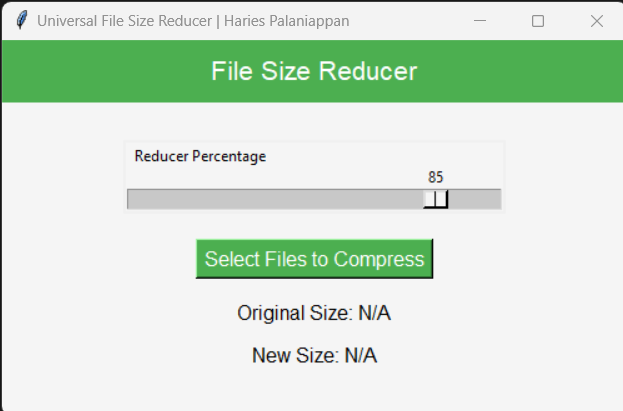
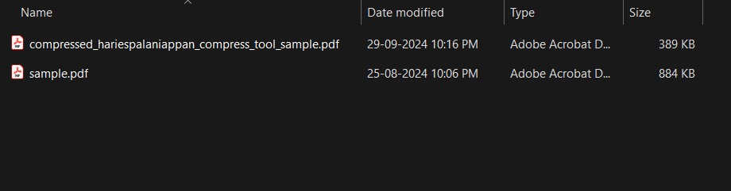
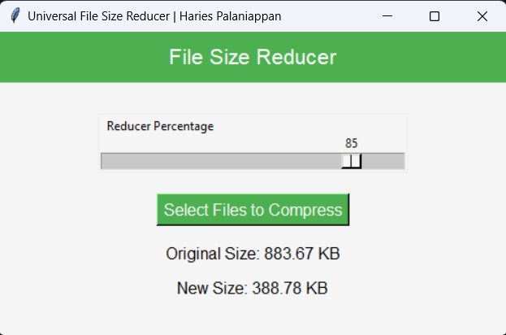

Here's the updated **README.md** content with the new screenshot names you provided:

```markdown
# Universal File Reducer

The **Universal File Reducer** is a Python-based tool that allows users to compress images, PDFs, Word documents, and Excel files while adding a watermark for identification. Designed for local use, this application ensures your sensitive data remains private and secure, eliminating the need to upload files to online services.

## Key Features

- **Local Processing**: Compress files without uploading them online, maintaining your privacy and control over your sensitive data.
- **Multiple File Formats**: Supports various file types, including images (PNG, JPG), PDFs, Word documents, and Excel spreadsheets.
- **Custom Watermark**: Add a personalized watermark to your files during compression for easy identification.
- **User-Friendly Interface**: A simple graphical interface that allows users to select and compress files easily.

## Why Use This Tool?

Unlike online file compressors that might keep a copy of your data, **Universal File Reducer** processes files locally on your machine. This is particularly useful when working with confidential or private data. 

## Screenshots

### File Reducer GUI



### Before Compression



### After Compression



## How to Use

1. Clone the repository:
   ```bash
   git clone https://github.com/haries-dev/Universal-File-Reducer.git
   cd Universal-File-Reducer
   ```

2. Install the required libraries:
   ```bash
   pip install -r requirements.txt
   ```

3. Run the script:
   ```bash
   python file_reducer.py
   ```

4. Use the graphical interface to select files for compression.

## Requirements

- **Python 3.x**
- **Libraries**:
  - `tkinter` (for the graphical interface)
  - `Pillow` (for image processing)
  - `pymupdf` (for PDF compression)
  - `python-docx` (for Word document processing)
  - `openpyxl` (for Excel file processing)

Install the required libraries by running:
```bash
pip install -r requirements.txt
```

## Example

1. Select an image, PDF, Word document, or Excel file using the tool's interface.
2. The file will be compressed, and a watermark with the text "hariespalaniappan_compress_tool" will be added.
3. The compressed file will be saved with a new name in the same directory as the original file.

## License

This project is licensed under the MIT License. See the [LICENSE](LICENSE) file for details.

## Contact

For any questions or feedback, feel free to contact me at [hariespalaniappan@gmail.com].
